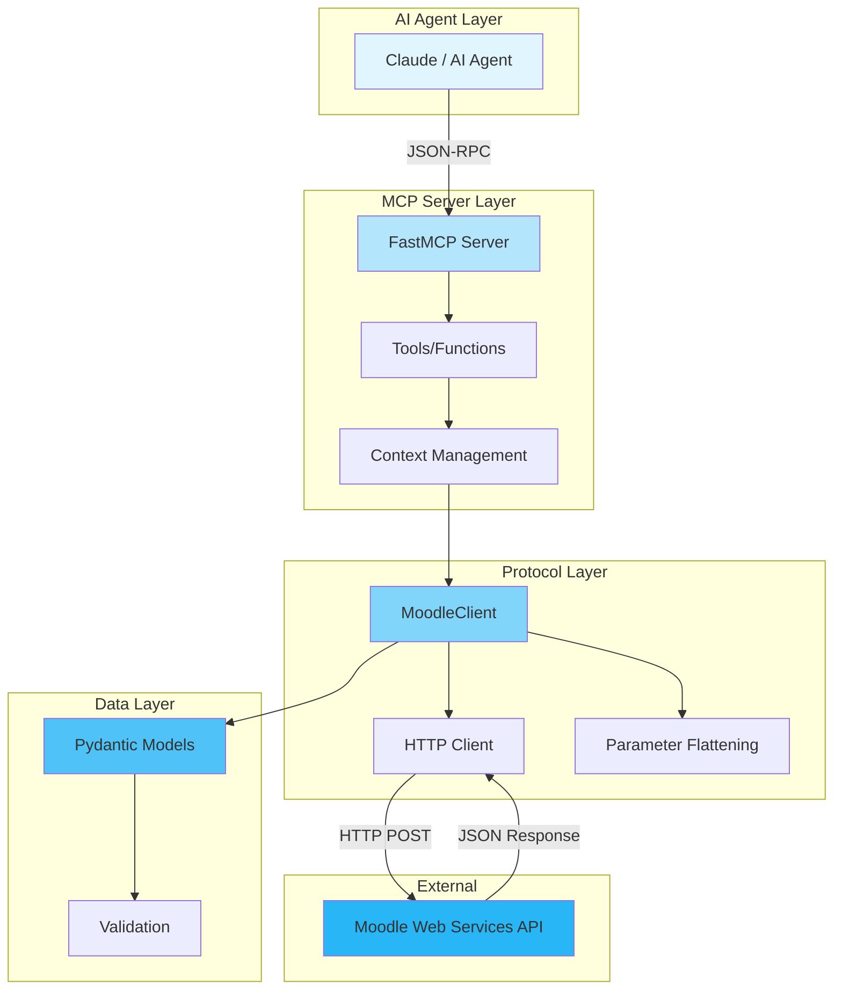
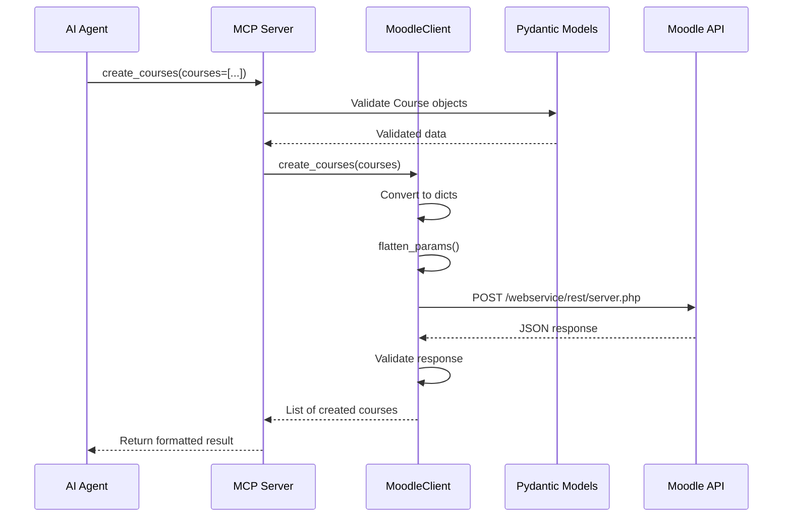
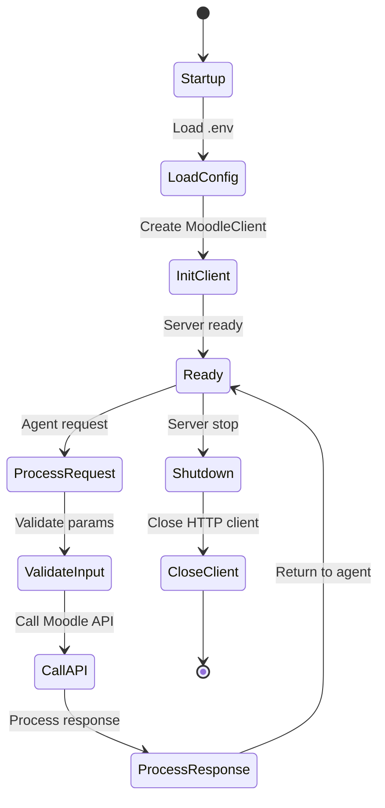

# System Architecture

## Overview

The system implements a layered architecture that clearly separates responsibilities:



## System Layers

### 1. AI Agent Layer

The AI agent (typically Claude) communicates with the MCP server using the JSON-RPC protocol over stdio.

**Features**:
- Bidirectional communication
- Automatic discovery of available tools
- Conversational context handling

### 2. MCP Server Layer

Implemented in `server.py`, defines the tools that the agent can use.

**Main components**:

- **FastMCP Server**: Framework that manages the MCP protocol
- **Tools**: Functions decorated with `@mcp.tool()` that expose functionality
- **Context Management**: Session lifecycle and state management
- **Lifespan Manager**: Initializes and cleans up resources (MoodleClient)

**Responsibilities**:
- Validate input parameters from the agent
- Manage logging and errors
- Coordinate calls to the Protocol Layer
- Format responses for the agent

### 3. Protocol Layer

Implemented in `protocol.py`, handles all communication with the Moodle API.

**Main class**: `MoodleClient`

**Components**:

- **HTTP Client**: `httpx.AsyncClient` client for asynchronous requests
- **Parameter Flattening**: Converts nested structures to Moodle format
- **Error Handling**: Centralized API error handling
- **Response Processing**: Response parsing and validation

**`flatten_params` function**:

Moodle expects parameters in a specific format:
```python
# Input (Python dict)
{"courses": [{"fullname": "Test", "categoryid": 1}]}

# Output (Moodle format)
{
    "courses[0][fullname]": "Test",
    "courses[0][categoryid]": 1
}
```

### 4. Data Layer

Implemented in `models.py` with Pydantic, defines data models.

**Features**:
- Automatic type validation
- Conversion to Moodle format (`to_moodle_dict()`)
- Integrated documentation
- Custom validators

**Model examples**:
- `Course`: Complete model for creating/updating courses
- `UserCreate`: Model for creating users
- `ManualEnrolment`: Model for enrollments
- And many more...

## Data Flow

### Example: Create a Course



### Detailed flow:

1. **AI Agent** requests to create courses with structured data
2. **MCP Server** receives the request and validates parameters with Pydantic
3. **Models** validate that data meets requirements (required fields, types, etc.)
4. **Server** calls `MoodleClient.create_courses()`
5. **MoodleClient**:
   - Converts Pydantic models to dictionaries
   - Flattens parameters to Moodle format
   - Performs HTTP POST with authentication
6. **Moodle API** processes the request and responds
7. **MoodleClient** validates the response and returns it
8. **Server** formats and sends result to the agent

## Error Management

The system implements error handling at multiple levels:

### Level 1: Validation Errors (Pydantic)
```python
# If required fields are missing or incorrect types
ValidationError: fullname is required
```

### Level 2: Protocol Errors (MoodleClient)
```python
# Moodle API errors
ValueError: Moodle API error: Invalid parameter value detected
```

### Level 3: HTTP Errors
```python
# Network or HTTP errors
httpx.HTTPError: Connection refused
```

### Level 4: Server Errors (MCP Tools)
```python
# Logged and propagated to the agent
await ctx.error(f"Error creating courses: {str(e)}")
raise
```

## Lifecycle



## Design Considerations

### Separation of Concerns

- **Server**: Only handles MCP interface, doesn't know Moodle details
- **Protocol**: Only handles HTTP communication, doesn't know MCP
- **Models**: Only define data structure, no business logic

### Asynchronicity

The entire flow is asynchronous (`async/await`) to:
- Not block during HTTP calls
- Allow concurrency
- Better performance with multiple requests

### Layered Validation

1. **Pydantic**: Type and structure validation
2. **MoodleClient**: API response validation
3. **Server**: Context and permissions validation

### State Management

- **Stateless between requests**: Each call is independent
- **Session state**: Maintained by the lifespan context manager
- **Reusable HTTP client**: One instance for the entire session

## Extensibility

### Add new MCP tool

1. Create model in `models.py` (if necessary)
2. Implement method in `MoodleClient` (`protocol.py`)
3. Create tool in `server.py` decorated with `@mcp.tool()`

### Add new Moodle API call

1. Define input/output models in `models.py`
2. Implement method in `MoodleClient` that:
   - Calls `_call_function()` with the Moodle function name
   - Processes and returns the response
3. Document with complete docstrings

## Testing

The architecture facilitates testing at multiple levels:

- **Unit Tests** (`test_moodle.py`): Mock only HTTP layer
- **Integration Tests** (`test_mcp.py`): Mock only HTTP, test complete integration
- **Fixtures** (`conftest.py`): Reusable test data

See [Testing](testing.md) for more details.
