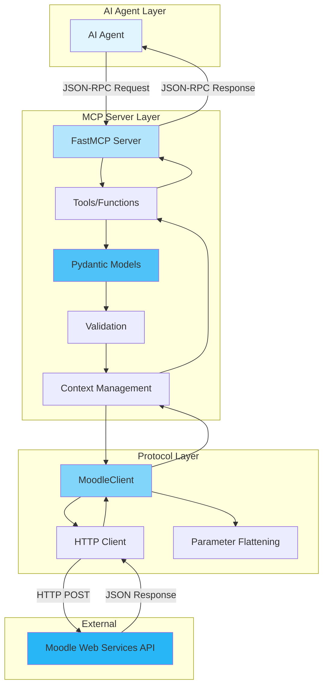
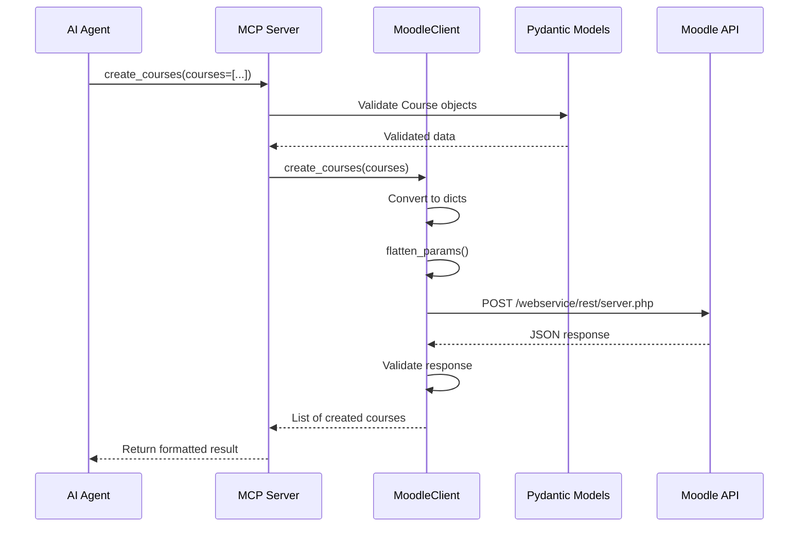
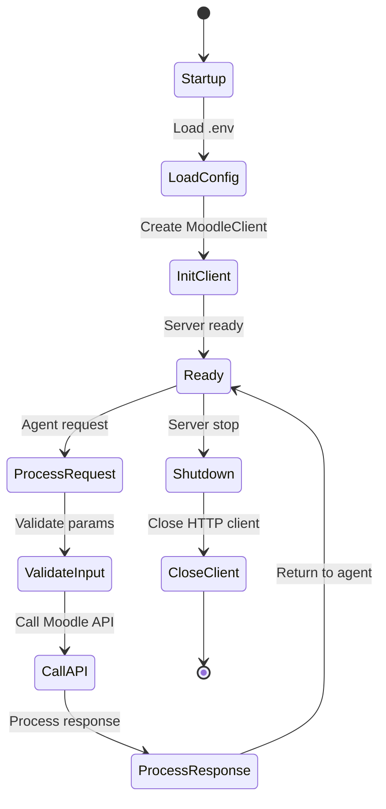

# System Architecture

## Overview

The system implements a layered architecture that clearly separates responsibilities:



## System Layers

### 1. AI Agent Layer

The AI agent (e.g. Claude) communicates with the MCP server using the JSON-RPC protocol over stdio. The agent initiates requests and receives responses through this standardized interface.

**Responsibilities**:

- Send tool call requests with structured parameters
- Receive and interpret responses from the MCP Server
- Handle conversational context and user interaction

**Communication protocol**:

- **JSON-RPC over stdio**: Bidirectional communication protocol
- **Tool discovery**: Automatic detection of available tools and their schemas
- **Stateless requests**: Each request is independent and self-contained

### 2. MCP Server Layer

Implemented in `server.py`, this layer serves as the bridge between the AI agent and the Moodle API.

**Components**:

- **FastMCP Server**: Framework that manages the MCP protocol, handles JSON-RPC communication, and routes requests to the appropriate tools
- **Tools/Functions**: Functions decorated with `@mcp.tool()` that define available operations. Each tool corresponds to one or more Moodle API operations
- **Pydantic Models**: Data models that define the structure and validation rules for tool parameters
- **Validation**: Automatic validation of incoming parameters against Pydantic model schemas
- **Context Management**: Manages the request context, session lifecycle, and lifespan state (MoodleClient instance)

**Request flow within this layer**:

1. **FastMCP Server** receives JSON-RPC request from the AI agent
2. Request is routed to the appropriate **Tool/Function**
3. Tool parameters are validated against **Pydantic Models**
4. **Validation** ensures type correctness and required fields
5. **Context Management** provides access to the shared MoodleClient instance
6. Tool calls the appropriate method on MoodleClient in the Protocol Layer

**Responsibilities**:

- Validate input parameters using Pydantic models
- Provide logging and error reporting to the agent
- Manage the MoodleClient lifecycle (initialization and cleanup)
- Format and structure responses for the agent
- Handle exceptions and convert them to user-friendly messages

### 3. Protocol Layer

Implemented in `protocol.py`, this layer handles all direct communication with the Moodle Web Services API.

**Components**:

- **MoodleClient**: Main class that orchestrates all Moodle API interactions. Contains methods for each supported Moodle webservice function
- **Parameter Flattening**: The `flatten_params()` function converts nested Python dictionaries and lists into Moodle's flat, bracketed format
- **HTTP Client**: `httpx.AsyncClient` instance that handles low-level HTTP communication

**Request flow within this layer**:

1. **MoodleClient** method is called from the MCP Server Layer
2. Parameters are converted to dictionaries (if Pydantic models)
3. **Parameter Flattening** transforms nested structures to Moodle format
4. **HTTP Client** sends POST request to Moodle API endpoint
5. Response is received and validated
6. Result is returned up to the MCP Server Layer

**`flatten_params` function**:

Moodle expects parameters in a specific format:

```python
# Input (Python dict)
{"courses": [{"fullname": "Test", "categoryid": 1}]}

# Output (Moodle format)
{
    "courses[0][fullname]": "Test",
    "courses[0][categoryid]": 1
}
```

**Responsibilities**:

- Format requests according to Moodle API requirements
- Authenticate requests with webservice token
- Parse and validate API responses
- Handle Moodle-specific errors
- Provide clean interfaces to the MCP Server Layer

### 4. Data Layer

Implemented in `models.py` with Pydantic, defines data models used primarily in the MCP Server Layer.

**Features**:

- Automatic type validation at the MCP Server Layer when tools receive arguments
- Conversion to Moodle format (`to_moodle_dict()`) before sending to Protocol Layer
- Integrated documentation via field descriptions
- Custom validators for complex business rules

**Includes**:

- Course models (Course, CourseUpdate, CourseContentsOption)
- Enrollment models (ManualEnrolment, ManualUnenrolment, EnrolledUsersOption)
- User models (UserCreate, UserSearchCriteria)
- Grade models (GradeItemDetails, StudentGrade)
- And many more...

### 5. External Layer

**Moodle Web Services API**: The external Moodle instance that receives HTTP POST requests and returns JSON responses. This layer is outside the project's control but defines the contract that the Protocol Layer must follow.

## Data Flow

### Example: Create a Course



### Detailed flow:

1. **AI Agent** sends a JSON-RPC request to create courses with structured data
2. **FastMCP Server** receives the request and routes it to the `create_courses` tool
3. **Pydantic Models** validate that the Course objects have all required fields and correct types
4. **Validation** confirms data integrity
5. **Context Management** provides the MoodleClient instance
6. **Tool** calls `MoodleClient.create_courses(courses)`
7. **MoodleClient**:
   - Converts Pydantic Course models to dictionaries via `to_moodle_dict()`
   - Calls `flatten_params()` to convert nested structures to Moodle format
   - Builds HTTP POST request with authentication token
   - Sends request via **HTTP Client** to Moodle API
8. **Moodle API** processes the request and returns JSON response
9. **HTTP Client** receives the response
10. **MoodleClient** validates the response (checks for errors, validates structure)
11. **MoodleClient** returns the list of created courses to the tool
12. **Tool** returns the result to **FastMCP Server**
13. **FastMCP Server** formats the response as JSON-RPC and sends it to the **AI Agent**

## Error Management

The system implements error handling at multiple levels:

### Level 1: Validation Errors (Pydantic)

```python
# If required fields are missing or incorrect types
ValidationError: fullname is required
```

### Level 2: Protocol Errors (MoodleClient)

```python
# Moodle API errors
ValueError: Moodle API error: Invalid parameter value detected
```

### Level 3: HTTP Errors

```python
# Network or HTTP errors
httpx.HTTPError: Connection refused
```

### Level 4: Server Errors (MCP Tools)

```python
# Logged and propagated to the agent
await ctx.error(f"Error creating courses: {str(e)}")
raise
```

## Lifecycle



## Design Considerations

### Separation of Concerns

- **MCP Server Layer**: Handles MCP protocol interface and validates data with Pydantic models. Has no knowledge of HTTP or Moodle-specific details
- **Protocol Layer**: Handles Moodle API communication and HTTP requests. Has no knowledge of MCP protocol or AI agent interaction
- **Data Layer**: Defines data structures and validation rules. Contains no business logic, only data definitions

### Asynchronicity

The entire flow is asynchronous (`async/await`) to enable non-blocking I/O operations, allowing the server to handle multiple concurrent requests efficiently without blocking on HTTP calls to Moodle.

### Layered Validation

1. **Pydantic (MCP Server Layer)**: Type and structure validation of tool arguments before any processing
2. **MoodleClient (Protocol Layer)**: API response validation and Moodle-specific error checking

### State Management

- **Stateless between requests**: Each API call is independent and self-contained
- **Session state**: Maintained by the lifespan context manager (`app_lifespan`)
- **Reusable HTTP client**: Single `httpx.AsyncClient` instance shared across the entire session for connection pooling and efficiency

## Extensibility

### Add new Moodle API call as MCP tool

1. **Create model in `models.py`** (if necessary): Define Pydantic models for input validation
2. **Implement method in `MoodleClient`** (`protocol.py`):
   - Create an async method that calls `_call_function()` with the Moodle function name
   - Process and return the response
   - Document with complete docstrings
3. **Create tool in `server.py`**: Decorate function with `@mcp.tool()` and call the MoodleClient method
4. **Test**: Add unit tests in `test_moodle.py` and integration tests in `test_mcp.py`

Example:
```python
# 1. models.py (if needed)
class MyNewModel(BaseModel):
    field1: str
    field2: int

# 2. protocol.py
async def my_new_operation(self, param: MyNewModel) -> dict[str, Any]:
    """Description of the operation."""
    data = param.to_moodle_dict()
    result = await self._call_function("moodle_function_name", **data)
    return result if isinstance(result, dict) else {}

# 3. server.py
@mcp.tool()
async def my_new_tool(ctx: Context, param: MyNewModel) -> dict[str, Any]:
    """Tool description."""
    client = ctx.request_context.lifespan_context
    return await client.my_new_operation(param)
```

## Testing

The architecture facilitates testing at multiple levels:

- **Unit Tests** (`test_moodle.py`): Test Protocol Layer in isolation by mocking only the HTTP client
- **Integration Tests** (`test_mcp.py`): Test the complete flow from MCP tools to Protocol Layer, mocking only HTTP
- **Fixtures** (`conftest.py`): Reusable test data and mock responses

See [Testing](testing.md) for more details.
