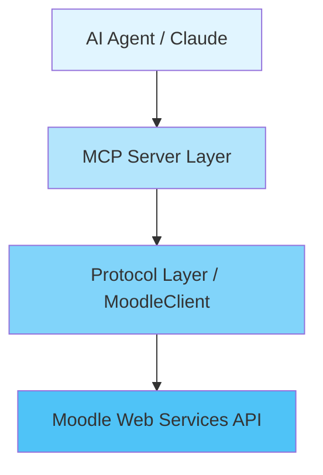

# MCP Moodle Server

**Model Context Protocol (MCP)** server for Moodle API integration.

## Project Description

This project implements an MCP server that acts as a proxy between AI agents and the Moodle Web Services API. It allows AI agents to interact with Moodle platforms in a structured and secure manner, providing tools to manage courses, users, grades, and more.

## Key Features

- **Course Management**: Create, read, update, and delete courses
- **User Management**: Create users and search by criteria
- **Enrollments**: Manually enroll and unenroll users
- **Grades**: Update grades and retrieve reports
- **Completion**: Check and update activity completion status
- **Clean Architecture**: Clear separation between protocol and server layers

## Architecture

The project follows a layered architecture:



- **MCP Server Layer** (`server.py`): Defines the tools available for the AI agent
- **Protocol Layer** (`protocol.py`): Implements communication with the Moodle API
- **Models** (`models.py`): Pydantic models for data validation

## Quick Start

### Installation

```bash
# Clone the repository
git clone https://github.com/yourusername/tfg-mcp-moodle-server.git
cd tfg-mcp-moodle-server

# Install dependencies
pip install -r requirements.txt
```

### Configuration

Create a `.env` file:

```env
MOODLE_URL=http://localhost:8000
MOODLE_TOKEN=your_token_here
```

### Usage with Claude Desktop

Add to Claude's configuration file:

```json
{
  "mcpServers": {
    "moodle": {
      "command": "python",
      "args": ["-m", "src.mcp.server"],
      "cwd": "/path/to/tfg-mcp-moodle-server"
    }
  }
}
```

## Documentation

- **[Architecture](architecture.md)**: System architecture details
- **[API Reference](api.md)**: Complete API documentation
- **[Testing](testing.md)**: Information about tests and coverage
- **[Usage Guide](usage.md)**: Installation, configuration, and examples

## Testing

```bash
# Run all tests
pytest

# With coverage
pytest --cov=src --cov-report=html

# Specific tests
pytest tests/test_moodle.py
```

## License

[Specify license]

## Author

Bachelor's Thesis Project (TFG)

---

**Technologies used**: Python, FastMCP, Pydantic, Moodle Web Services API
