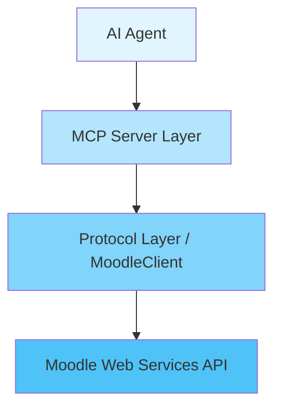

# MCP Moodle Server

**Model Context Protocol (MCP)** server for Moodle API integration.

## Project Description

This project implements an MCP server that acts as a proxy between AI agents and the Moodle Web Services API. It allows AI agents to interact with Moodle platforms in a structured and secure manner, providing tools to manage courses, users, grades, and more.

## Key Features

- **Course Management**: Create, read, update, and delete courses
- **User Management**: Create users and search by criteria
- **Enrollments**: Manually enroll and unenroll users
- **Grades**: Update grades and retrieve reports
- **Completion**: Check and update activity completion status
- **Clean Architecture**: Clear separation between protocol and server layers

## Architecture

The project follows a layered architecture:



- **MCP Server Layer** (`server.py`): Defines the tools available for the AI agent
- **Protocol Layer** (`protocol.py`): Implements communication with the Moodle API
- **Models** (`models.py`): Pydantic models for data validation

## Quick Start

### Installation

1. **Clone the repository:**
   ```bash
   git clone https://github.com/Hefi002/tfg-mcp-moodle-server.git
   cd tfg-mcp-moodle-server
   ```

2. **Create a virtual environment:**
   ```bash
   # Windows
   python -m venv venv
   venv\Scripts\activate

   # Linux/Mac
   python3 -m venv venv
   source venv/bin/activate
   ```

3. **Install dependencies:**
   ```bash
   pip install -r requirements.txt
   ```

4. **Install development dependencies (for testing):**
   ```bash
   pip install -r requirements-dev.txt
   ```

5. **Run the interactive setup:**
   ```bash
   python setup.py
   ```

   The setup script will guide you through configuring your Moodle URL, authentication token, and logging preferences.

6. **Verify the installation:**
   ```bash
   pytest
   ```

   > **Note:** You need to install `requirements-dev.txt` to run pytest (step 4).

> **Note**: For detailed installation instructions, configuration options, and troubleshooting, see the [Installation and Usage Guide](usage.md).

## Usage

### Starting the Server

1. **Activate your virtual environment:**
   ```bash
   # Windows
   venv\Scripts\activate

   # Linux/Mac
   source venv/bin/activate
   ```
   
2. **Run the server:**
   ```bash
   python -m src
   ```
   
   Or alternatively:
   ```bash
   python -m src.mcp.server
   ```

3. **To close the server once you are done:**
    - Press `CTRL + C` in the terminal
    - Then exit your virtual environment:
    ```bash
    deactivate
    ```

### Connecting with Claude Desktop

Claude Desktop is used as example, each AI has its methods of adding an MCP tool.

To add the server to your Claude Desktop configuration:

1. Open Claude Desktop and go to `Settings`.
2. Navigate to the `Developer` section, then choose `Edit config`.
3. Edit the file `claude_desktop_config.json` to add the following MCP server configuration:

**Windows:**
```json
{
  "mcpServers": {
    "moodle-api": {
      "command": "C:\\path\\to\\tfg-mcp-moodle-server\\venv\\Scripts\\python.exe",
      "args": ["-m", "src.mcp.server"],
      "cwd": "C:\\path\\to\\tfg-mcp-moodle-server",
      "env": {
        "PYTHONPATH": "C:\\path\\to\\tfg-mcp-moodle-server"
      }
    }
  }
}
```

**Linux/macOS:**
```json
{
  "mcpServers": {
    "moodle-api": {
      "command": "/path/to/tfg-mcp-moodle-server/venv/bin/python",
      "args": ["-m", "src.mcp.server"],
      "cwd": "/path/to/tfg-mcp-moodle-server",
      "env": {
        "PYTHONPATH": "/path/to/tfg-mcp-moodle-server"
      }
    }
  }
}
```

4. Replace `/path/to/tfg-mcp-moodle-server` with the actual path where you cloned the project.
5. Once added, restart Claude Desktop to apply the changes.

### Example Usage

Once connected, you can use natural language to interact with Moodle:

```
"Show me all courses in my Moodle instance"
"Get the enrolled users in course ID 5"
"What's the completion status for user 10 in course 3?"
"List all assignments in course 'Introduction to Python'"
```

## Documentation

- **[Architecture](architecture.md)**: System architecture details
- **[API Reference](api.md)**: Complete API documentation
- **[Testing](testing.md)**: Information about tests and coverage
- **[Usage Guide](usage.md)**: Installation, configuration, and examples

## Testing

```bash
# Run all tests
pytest

# With coverage
pytest --cov=src --cov-report=html

# Specific tests
pytest tests/test_moodle.py
```

## License

This project is licensed under the MIT License - see the [LICENSE](LICENSE) file for details.

## Author

**Author**: Eric Herrero Espada

**Program**: Grau en Enginyeria Informàtica (Bachelor's Degree in Computer Engineering)

**Institution**: Universitat Politècnica de Catalunya

**Academic Year**: 2025-2026

**Thesis Supervisor**: Marc Alier Forment

**Thesis Type**: (Treball de Fi de Grau) Final Degree Project

---

**Technologies used**: Python, FastMCP, Pydantic, Moodle Web Services API
